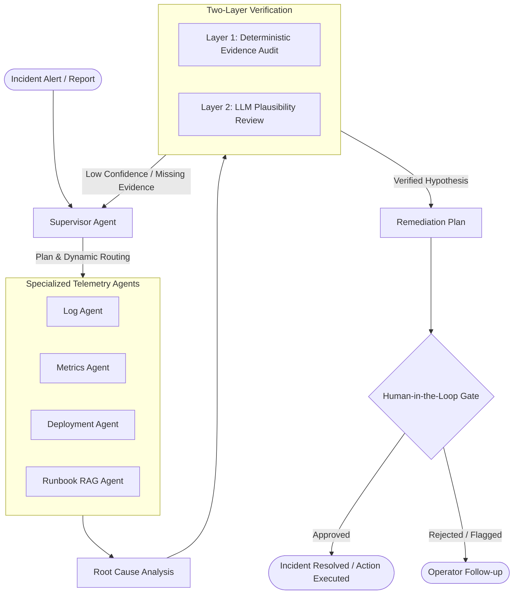

# IncidentPilot

> **Multi-Agent Production Incident Response & Investigation System**

[](https://www.python.org/)
[](https://fastapi.tiangolo.com/)
[](https://github.com/langchain-ai/langgraph)
[](https://streamlit.io/)
[](https://qdrant.tech/)
[]()
[](LICENSE)

IncidentPilot is an automated incident investigation and response system built with **LangGraph**, **FastAPI**, and **Streamlit**. It coordinates specialized investigation agents across logs, metrics, deployment changes, and operational runbooks to diagnose production incidents, verify telemetry evidence, and propose human-gated remediation actions.

---

## Architecture Overview

IncidentPilot models the incident response lifecycle as a stateful, cyclic multi-agent graph with deterministic verification and operator approval gating:



---

## Key Features

- **Dynamic Multi-Agent Orchestration**: A central **Supervisor** reviews incident symptoms and selectively activates domain specialists (logs, metrics, deployments, runbooks), skipping irrelevant queries.
- **Evidence-Grounded RCA**: Hypotheses cite concrete telemetry records collected during the investigation. Diagnostic confidence is weighted by an explainable Evidence Quality Score.
- **Two-Layer Verification**:
  - **Layer 1 (Deterministic)**: Code-level validation verifying cited IDs exist in the database, match target service scopes, and fall within valid time windows.
  - **Layer 2 (Semantic)**: LLM-driven adversarial review that evaluates causal plausibility and challenges potential hallucinations.
- **Runbook RAG**: Automatically retrieves operational runbooks via **FastEmbed** (`BAAI/bge-small-en-v1.5`) and **Qdrant** vector search to recommend established mitigation procedures.
- **Human-in-the-Loop Gating**: Remediations are advisory and require operator sign-off (`PENDING_APPROVAL` &rarr; `APPROVED` / `REJECTED`) before any action is marked complete.
- **Decoupled Architecture**: Stateless FastAPI backend exposing clean REST endpoints, with an interactive Streamlit dashboard for real-time triage and review.

---

## Tech Stack

| Component | Technology | Description |
|---|---|---|
| **Orchestration** | LangGraph, LangChain Core | Cyclic multi-agent graph with dynamic conditional routing |
| **LLM Inference** | Groq API (`llama-3.3-70b-versatile`) | Fast causal inference, log reasoning, and adversarial review |
| **Backend API** | FastAPI, Uvicorn, Pydantic v2 | RESTful service layer with schema validation and CORS |
| **Vector Search (RAG)** | Qdrant, FastEmbed | Local embeddings (`bge-small-en-v1.5`) & dense runbook retrieval |
| **Storage & ORM** | SQLAlchemy 2.0, SQLite / PostgreSQL | Relational storage for incidents, telemetry, and investigations |
| **Frontend** | Streamlit | SRE console with investigation traces and approval actions |
| **Testing** | Pytest, Pytest-Asyncio | 67 automated unit and integration tests |

---

## Project Structure

```text
IncidentPilot/
├── app/
│   ├── agents/            # Specialist agents (supervisor, logs, metrics, deployments, etc.)
│   │   ├── supervisor.py       # Triage and specialist routing logic
│   │   ├── logs.py             # Log aggregation and query agent
│   │   ├── metrics.py          # Metric anomaly inspection agent
│   │   ├── deployments.py      # Deployment and rollback analyzer
│   │   ├── runbook.py          # Runbook recommendation agent
│   │   ├── root_cause.py       # RCA synthesis and hypothesis formulation
│   │   └── verification.py     # Two-layer deterministic and LLM verification
│   ├── api/               # FastAPI endpoints and Pydantic schemas
│   ├── db/                # SQLAlchemy database models, connection, and seed scripts
│   ├── graph/             # LangGraph state definitions and workflow construction
│   ├── rag/               # Vector retriever and markdown runbook indexer
│   ├── tools/             # Deterministic tools for querying telemetry data
│   ├── config.py          # Environment settings (Pydantic Settings)
│   └── main.py            # FastAPI application entrypoint
├── data/
│   ├── runbooks/          # Standard operational procedure runbooks (Markdown)
│   └── seed_data.json     # Seed telemetry for simulated incidents
├── evaluation/
│   ├── incidents.json     # Benchmark evaluation scenarios
│   └── run_eval.py        # Automated benchmark test harness
├── frontend/
│   └── app.py             # Streamlit web dashboard
├── tests/                 # Complete test suite (67 tests)
├── docker-compose.yml     # Multi-container orchestration (API, UI, Postgres, Qdrant)
├── Dockerfile             # Container definition for API and Frontend
├── requirements.txt       # Production dependencies
└── requirements-dev.txt   # Development and test dependencies
```

---

## Getting Started

### Prerequisites

- **Python**: 3.11 or later
- **Groq API Key**: Obtain a key from [console.groq.com](https://console.groq.com/)

### 1. Clone & Set Up Virtual Environment

```bash
git clone https://github.com/SoumyaRM2004/IncidentPilot-Multi-Agent-Production-Incident-Response-System.git
cd IncidentPilot-Multi-Agent-Production-Incident-Response-System

# Create and activate virtual environment
python -m venv .venv

# Windows (PowerShell):
.\.venv\Scripts\Activate.ps1

# Linux / macOS:
source .venv/bin/activate

# Install dependencies
pip install -r requirements-dev.txt
```

### 2. Environment Configuration

Copy the example environment configuration:

```bash
cp .env.example .env
```

Edit `.env` to supply your credentials:

```env
GROQ_API_KEY=gsk_your_groq_api_key_here
GROQ_MODEL=llama-3.3-70b-versatile
DATABASE_URL=sqlite:///./incidentpilot.db
QDRANT_URL=:memory:
```

### 3. Initialize and Seed the Database

Populate the database with sample production incidents and corresponding telemetry (logs, metrics, deployments):

```bash
python -m app.db.seed
```

---

## Running the Application

IncidentPilot runs as two independent services:

### Option A: Local Development

**Terminal 1 — FastAPI Backend:**
```bash
uvicorn app.main:app --host 0.0.0.0 --port 8000 --reload
```
- API Docs (Swagger UI): [http://localhost:8000/docs](http://localhost:8000/docs)
- Health Check: [http://localhost:8000/health](http://localhost:8000/health)

**Terminal 2 — Streamlit Frontend:**
```bash
streamlit run frontend/app.py --server.port 8501
```
- Dashboard UI: [http://localhost:8501](http://localhost:8501)

---

### Option B: Docker Compose

Launch the full stack (FastAPI, Streamlit, PostgreSQL, and Qdrant) with a single command:

```bash
docker compose up --build
```

Services will be mapped to:
- **FastAPI**: `http://localhost:8000`
- **Streamlit**: `http://localhost:8501`
- **Qdrant**: `http://localhost:6333`
- **PostgreSQL**: `localhost:5432`

---

## REST API Reference

| Method | Endpoint | Description |
|---|---|---|
| `GET` | `/health` | Service health status |
| `GET` | `/incidents` | List all incidents |
| `POST` | `/incidents` | Create a new incident report |
| `GET` | `/incidents/{id}` | Get incident details and current status |
| `POST` | `/incidents/{id}/investigate` | Trigger multi-agent investigation workflow |
| `GET` | `/investigations/{id}` | Retrieve investigation results and evidence trace |
| `POST` | `/investigations/{id}/approve` | Persistently approve proposed remediation |
| `POST` | `/investigations/{id}/reject` | Persistently reject proposed remediation |

Interactive API documentation and schema exploration is available at `/docs`.

---

## Testing & Evaluation

### Running Tests

The test suite covers agent behavior, API contracts, LangGraph routing, deterministic verification, and rate-limit resilience:

```bash
pytest
```

### Benchmark Evaluation

To evaluate system performance against 10 synthetic production failure scenarios (standard, noisy, insufficient, and contradictory telemetry):

```bash
python evaluation/run_eval.py
```

Evaluation supports both:
- **Offline Pipeline Mode**: Deterministic check verifying telemetry matching, evidence routing, and Layer 1 verification without API costs.
- **Live LLM Mode**: Full end-to-end evaluation using live Groq API inference.

---

## License

This project is licensed under the [MIT License](LICENSE).
